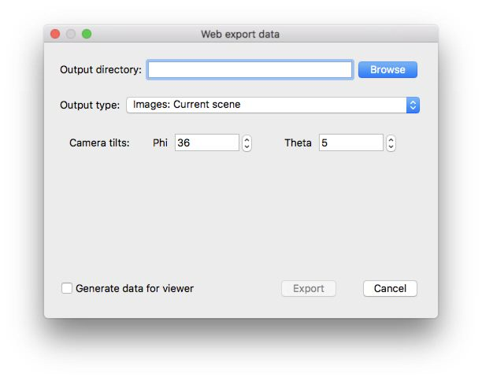

title: Images current scene
---

Tomviz Web export.

<center>

</center>

<!-- <script type="text/javascript" src="https://unpkg.com/tomvizweb"></script> -->

```
<div
  class="tomviz-data-viewer"
  data-url="../data/ImagesCurrentScene.tomviz"
  data-viewport="600x500"

  data-no-ui
  data-no-mouse

  data-initialization="theta=126"
  data-animation="phi=100"
/>
```

<center>
<div
  class="tomviz-data-viewer"
  data-url="../data/ImagesCurrentScene.tomviz"
  data-viewport="600x500"

  data-no-ui
  data-no-mouse

  data-initialization="theta=126"
  data-animation="phi=100"
/>
</div>
</center>

<script type="text/javascript" src="../data/js/tomviz.js"></script>
