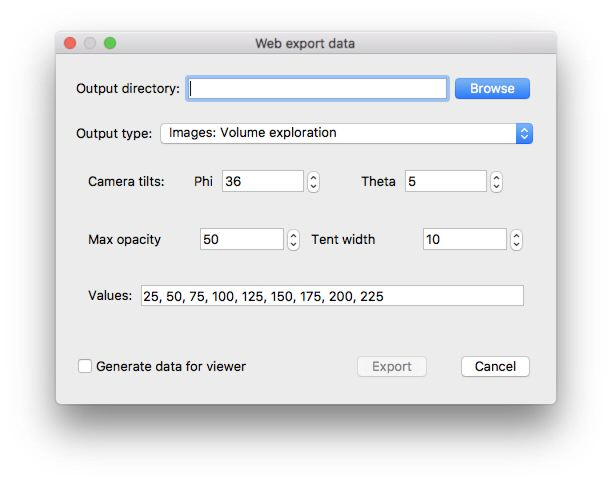

title: Images volume exploration
---

This exports the current scene with some exploration of the volume.

<center>

</center>

```
<div
  class="tomviz-data-viewer"
  data-url="../data/ImagesVolumeExploration.tomviz"
  data-viewport="600x500"

  data-no-ui
  data-no-mouse

  data-initialization="theta=126"
  data-animation="phi=100&volume=500"
/>
<script type="text/javascript" src="https://unpkg.com/tomvizweb"></script>
```

<center>
<div
  class="tomviz-data-viewer"
  data-url="../data/ImagesVolumeExploration.tomviz"
  data-viewport="600x500"

  data-no-ui
  data-no-mouse

  data-initialization="theta=126"
  data-animation="phi=150&volume=500"
/>
</div>
</center>

<script type="text/javascript" src="../data/js/tomviz.js"></script>
